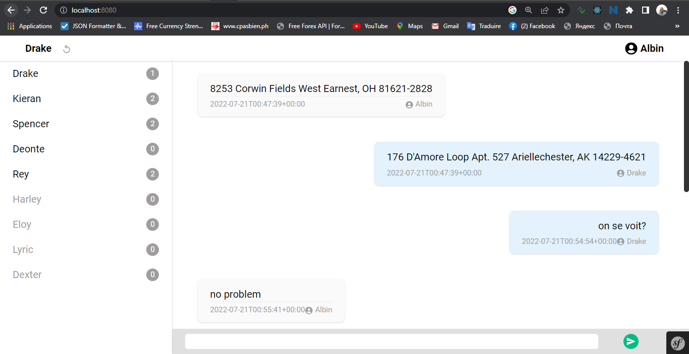

# KD-INSTANT-CHAT

L’objectif de cette exercice et de développer une messagerie instantané en utilisant une API
GraphQL



## TECHNOLOGIES UTILISEES

- Symfony 5.4
- graphql-php 
- Reactjs 18
- Tailwindcss 3
- Api-platform pour l'intégration graphql
- MySQL (5.7)

# COMMENT DEMARRER L'APPLICATION

- Se positionner sur le dossier de travail:
````
cd kd-instant-chat-2
````
- Installer les packages PHP:
````
composer install
````
- Installer les packages javascript:
````
yarn install
````
-Generer la base des données:   
On suppose l'utilisateur mysql est __root__ et n'a pas de mot de passe.
````
php bin/console doctrine:database:create
````
-Generer mettre à jour le schémas de la BD:
````
php bin/console doctrine:migrations:migrate
````
-Generer les fausses données (fixtures) pour les tests:
````
php bin/console  doctrine:fixtures:load
````
-Installer les assets (pour api-platform et graphql):
````
php bin/console  assets:install
````
-Lancer mercure (nous avons utilisé le binaire pour windows-x86-x64):
````
mercure -d -a localhost:5000 -X -c * --jwt-key "!ChangeMe!" --publisher-jwt-key "!ChangeMe!"
````

-Lancer le serveur:  
S'assurer d'avoir installer symfony-cli (le binaire de symfony inclus dans ce projet est pour windows)
````
symfony serve --port=8000
````

# EXPLORER L'APP

- Url de l'app (verifier que le port est le meme que celui du serveur)
````
http://localhost:8000
````

- Url de Graphql (verifier que le port est le meme que celui du serveur)
````
http://localhost:8000/api/graphql
````

# IDENTIFIANTS DE CONNEXION

On a dit 10 users ayant tous comme mot de passe __12345678__ et des emails du type __user1@gmail.com__ à __user10@gmail.com__

# S'AUTHENTIFIER A L'API

````
curl -X 'POST' \
  'http://localhost:8080/api/login' \
  -H 'accept: application/json' \
  -H 'Content-Type: application/json' \
  -d '{
  "username": "user5@gmail.com",
  "password": "12345678"
}'
````

````
{
  "id": 35,
  "email": "user5@gmail.com",
  "roles": [
    "ROLE_USER"
  ],
  "password": "$2y$13$My.HdVURZEdTvitaEWM3hOi6uP08B/53JCR8nzjS5xI0lJw9XHVGm",
  "apiToken": "000ad4c06afd09f16652cdfa44692f34e5dc2f98",
  "fullName": "Deonte",
  "userIdentifier": "user5@gmail.com",
  "username": "user5@gmail.com",
  "salt": null
}
````

Utiliser le __apiToken__ dans l'en-tete __X-AUTH-TOKEN__ ou dans le parametre d'url __api_token__ pour s'authentifier sur l'API.